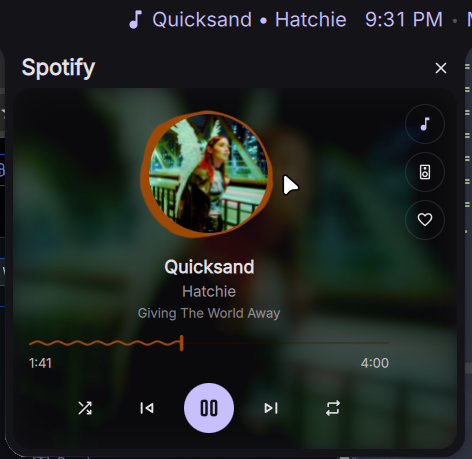

# Spotify Like

A [DankMaterialShell](https://github.com/AvengeMedia/DankMaterialShell) plugin that gives you a media popout styled after DankDash's own Media tab — same blurred-artwork card, seekbar, and transport controls — plus a heart button to save or remove the currently playing track from your Spotify Library, directly from the bar.

## Features

- Bar pill showing the current track, with a popout matching DankDash's Media card
- Volume control (click to open a slider, scroll to adjust) and an output-device picker
- Heart button to save/unsave the current track in your Spotify Library — filled and colored when saved
- Uses the real Spotify track ID from MPRIS, so it only lights up for tracks actually playing in the official Spotify client

## Setup

This plugin talks to the Spotify Web API directly, so it needs its own (free) Spotify app registration — no shared client ID is baked in.

1. Go to the [Spotify Developer Dashboard](https://developer.spotify.com/dashboard) and create an app (any name/description works).
2. In the app's **Settings**, add a Redirect URI: `http://127.0.0.1:8899/callback` (or pick a different port — just keep it in sync with the plugin setting below).
3. Copy the app's **Client ID**.
4. Install the plugin, open its settings (right-click the bar pill, or Settings → Plugins → Spotify Like), paste the Client ID in, and click **Connect to Spotify**. Approve access in the browser tab that opens.
5. In the Spotify app dashboard, go to **Settings → Users and Access** and add your own Spotify account — apps in Development Mode block Library reads/writes for any account that isn't explicitly allowlisted, including the app's own creator.

That's it — the heart button should start reflecting and controlling your Library.

> **Note:** the official Spotify client's own now-playing heart icon doesn't reliably live-refresh when your Library is changed by an external app (like this plugin) via the API. If a save/unsave doesn't seem to show up in Spotify, don't trust that icon — check your **Liked Songs** playlist instead, which reflects the real state.

## Requirements

- `python3` (stdlib only — used for both the one-time OAuth login flow and every Web API call)
- DankMaterialShell `>= 1.6.0`

## How it works

- Authentication is Authorization Code + PKCE with a loopback redirect (`spotify_auth.py`) — no client secret needed, nothing but stdlib.
- Tokens are stored in DMS's per-plugin state file (`~/.local/state/DankMaterialShell/plugins/spotifyLike_state.json`), not in the plugin's settings.
- The heart button uses Spotify's `/v1/me/library` endpoints (the current, non-deprecated Library API).
- Every Web API call goes through `spotify_api.py`, a stdlib-only helper that is handed one JSON line on **stdin** and answers with one JSON line on stdout. Two reasons: the bearer token never appears in the process's `argv`, which on Linux is world-readable through `/proc/<pid>/cmdline`; and the helper only exposes the four fixed Spotify operations below, so it cannot be repurposed into a general HTTP client that forwards the token elsewhere.
- **One track, one request.** The library state for a track is fetched once and cached, so re-opening the popout or editing a setting costs nothing, and a token that is about to expire is refreshed once and shared by everything waiting on it. Spotify's per-app rate limit is small enough that this is the difference between a plugin that runs all day and one that gets itself throttled.

## License

MIT — see [LICENSE](LICENSE).
